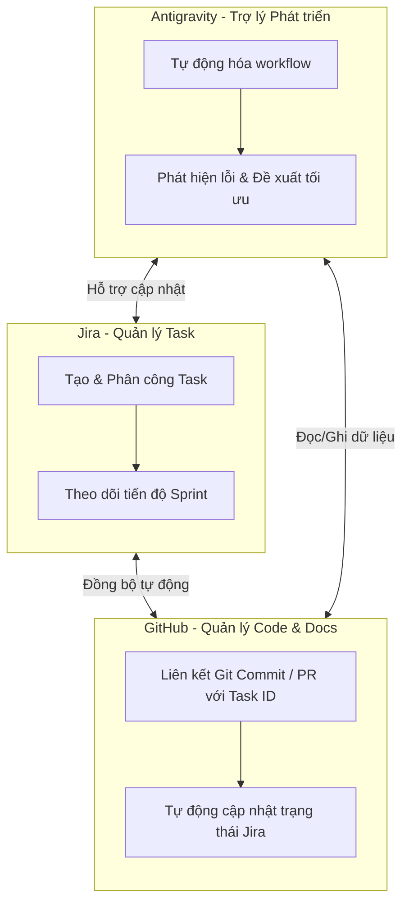

# 📋 KẾ HOẠCH THỰC HIỆN DỰ ÁN (PROJECT PLAN)
## Manga Creation Workflow and Publishing Management System

> [!NOTE]  
> Tài liệu này được xây dựng nhằm phân chia công việc, quản lý tiến độ và phối hợp giữa các thành viên trong quá trình phát triển hệ thống **Manga Creation Workflow and Publishing Management System** và hoàn thiện báo cáo đồ án.  
> Project Plan đóng vai trò định hướng toàn bộ hoạt động từ khảo sát, phân tích, thiết kế, triển khai cơ sở dữ liệu đến viết báo cáo LaTeX và bảo vệ đồ án.

---

## 🎯 1. Mục tiêu thực hiện

*   **Đúng tiến độ:** Hoàn thành toàn bộ các giai đoạn của đồ án đúng thời gian quy định.
*   **Chất lượng cao:** Đảm bảo nội dung báo cáo đầy đủ, chính xác, lập luận khoa học và thống nhất.
*   **Phân vai rõ ràng:** Phân chia công việc hợp lý, phát huy tối đa năng lực cá nhân của từng thành viên.
*   **Quản lý chuyên nghiệp:** Giám sát tiến độ chặt chẽ qua các công cụ hỗ trợ quản lý công việc hiện đại.
*   **Đồng bộ dữ liệu:** Đảm bảo tính nhất quán tuyệt đối giữa tài liệu đặc tả thiết kế, sơ đồ UML và hệ thống thực tế.

---

## 👥 2. Phân chia công việc chi tiết

Để thuận tiện trong việc triển khai và theo dõi tiến độ, công việc được phân chia chi tiết cho từng thành viên dưới dạng checklist nhiệm vụ:

### 👑 2.1. Trương Trọng Tấn (Leader)
*   **Vai trò:** Tổng hợp & Quản lý dự án
*   **File LaTeX đảm nhận:** `01_gioi_thieu.tex`
*   **Danh sách công việc:**
    *   [ ] Viết Lời cảm ơn, Thuật ngữ và từ viết tắt.
    *   [ ] Thực hiện **Chương I: Giới thiệu dự án**.
    *   [ ] Tổng hợp toàn bộ nội dung báo cáo đồ án.
    *   [ ] Kiểm tra định dạng (format) tài liệu LaTeX.
    *   [ ] Quản lý GitHub Repository (Kiểm soát lỗi trình bày, duyệt và merge code/tài liệu).
    *   [ ] Đảm bảo tính đồng bộ nội dung giữa các chương.

### 📝 2.2 Giang Thị Ngọc Hân
*   **Vai trò:** Phân tích yêu cầu chức năng
*   **File LaTeX đảm nhận:** `02_1_yeu_cau_chuc_nang.tex`
*   **Danh sách công việc:**
    *   [ ] Viết **Chương II: Tổng quan hệ thống**.
    *   [ ] Thu thập và phân tích yêu cầu từ phía người dùng.
    *   [ ] Phân tích và đặc tả yêu cầu chức năng.
    *   [ ] Mô tả chi tiết vai trò và chức năng của từng Actor.
    *   [ ] Hoàn thiện tài liệu đặc tả chức năng hệ thống.

### 🔍 2.3. Dương Kim Ngân
*   **Vai trò:** Phân tích yêu cầu phi chức năng & Nghiệp vụ
*   **File LaTeX đảm nhận:** `02_2_yeu_cau_phi_chuc_nang.tex`
*   **Danh sách công việc:**
    *   [ ] Phân tích và soạn thảo các yêu cầu phi chức năng.
    *   [ ] Xây dựng quy tắc nghiệp vụ hệ thống (Business Rules).
    *   [ ] Xác định các ràng buộc kỹ thuật và vận hành của hệ thống.
    *   [ ] Hoàn thiện phần giả định hệ thống.
    *   [ ] Viết phần kết luận cho Chương II.

### 🎨 2.4. Nguyễn Thanh Thảo
*   **Vai trò:** Thiết kế Use Case & Quy trình nghiệp vụ
*   **File LaTeX đảm nhận:** `03_2_uml_nghiep_vu.tex`
*   **Danh sách công việc:**
    *   [ ] Thiết lập danh sách và mô tả các Actor.
    *   [ ] Thiết kế Use Case Diagram tổng thể và chi tiết.
    *   [ ] Thiết kế Swimlane Diagram và Activity Diagram cho các quy trình nghiệp vụ.
    *   [ ] Viết mô tả nghiệp vụ chi tiết cho từng sơ đồ thiết kế.

### 📐 2.5. Nguyễn Thị Trúc Ngân
*   **Vai trò:** Thiết kế Kiến trúc & UML hệ thống
*   **File LaTeX đảm nhận:** `03_1_thiet_ke_tong_the.tex` và `03_3_uml_thiet_ke.tex`
*   **Danh sách công việc:**
    *   [ ] Thiết kế kiến trúc tổng thể của hệ thống.
    *   [ ] Thiết kế mô hình triển khai hệ thống (Deployment Diagram).
    *   [ ] Thiết kế Sequence Diagram cho các luồng xử lý chính.
    *   [ ] Thiết kế Class Diagram chi tiết của hệ thống.
    *   [ ] Mô tả cấu trúc các lớp chính và chuẩn hóa mối quan hệ giữa chúng.

### 💾 2.6. Phan Thị Hạnh
*   **Vai trò:** Thiết kế Cơ sở dữ liệu (Database)
*   **File LaTeX đảm nhận:** `03_4_database_ui.tex`
*   **Danh sách công việc:**
    *   [ ] Thiết kế lược đồ cơ sở dữ liệu hệ thống (Database Schema).
    *   [ ] Thiết kế sơ đồ quan hệ thực thể (ERD).
    *   [ ] Xây dựng Từ điển dữ liệu (Data Dictionary) chi tiết cho các bảng.
    *   [ ] Định nghĩa các thuộc tính, khóa chính, khóa ngoại và ràng buộc dữ liệu.
    *   [ ] Kiểm tra và tối ưu hóa tính toàn vẹn dữ liệu.

---

## 📅 3. Lộ trình & Kế hoạch thực hiện
Để tiện theo dõi, tiến trình thực hiện đồ án được chia thành các cột mốc cụ thể sau:

### 📍 Giai đoạn 1: Khảo sát đề tài và thu thập yêu cầu
*   **Nội dung:** Thực hiện khảo sát thực tế quy trình sáng tác và xuất bản manga.
*   **Kết quả đầu ra:** Hoàn thiện mô tả bài toán thực tế và xác định rõ phạm vi của hệ thống.

### 📍 Giai đoạn 2: Phân tích chi tiết yêu cầu hệ thống
*   **Nội dung:** Phân tích các yêu cầu thu thập được từ người dùng và hệ thống.
*   **Kết quả đầu ra:** Hoàn thiện đặc tả yêu cầu chức năng (Usecase) và phi chức năng.

### 📍 Giai đoạn 3: Thiết kế sơ đồ UML & Quy trình nghiệp vụ
*   **Nội dung:** Thiết kế luồng đi của dữ liệu và các hành vi tương tác trong hệ thống.
*   **Kết quả đầu ra:** Hoàn thành Use Case, Activity và Sequence Diagram hoàn chỉnh.

### 📍 Giai đoạn 4: Thiết kế Class Diagram & Cơ sở dữ liệu
*   **Nội dung:** Chuyển đổi mô hình phân tích thành mô hình dữ liệu thực tế và cấu trúc hệ thống.
*   **Kết quả đầu ra:** Hoàn thành Class Diagram chi tiết, sơ đồ ERD và Data Dictionary.

### 📍 Giai đoạn 5: Tổng hợp, biên soạn và chuẩn hóa tài liệu
*   **Nội dung:** Biên tập toàn bộ nội dung sang LaTeX và kiểm tra lỗi định dạng.
*   **Kết quả đầu ra:** Hoàn thiện báo cáo LaTeX hoàn chỉnh, sẵn sàng biên dịch.

### 📍 Giai đoạn 6: Kiểm tra, tối ưu hóa và hoàn thiện cuối cùng
*   **Nội dung:** Đánh giá chất lượng cuối cùng, sửa lỗi phát sinh và chuẩn bị slide thuyết trình.
*   **Kết quả đầu ra:** Hoàn thiện tài liệu nộp chính thức và sẵn sàng bảo vệ đồ án.

---

## 🛠️ 4. Công cụ hỗ trợ và Môi trường làm việc

Hệ thống công cụ hỗ trợ và môi trường phát triển được phân chia theo từng mục đích sử dụng cụ thể:

### 💻 Phát triển & Soạn thảo
*   **Visual Studio Code (VS Code):** Môi trường lập trình chính để code hệ thống và viết tài liệu.
*   **XAMPP & MySQL:** Môi trường chạy thử nghiệm local server và quản trị cơ sở dữ liệu.

### 📐 Thiết kế sơ đồ (Diagrams)
*   **Draw.io:** Vẽ sơ đồ quy trình nghiệp vụ (Swimlane) và sơ đồ Use Case tổng thể.
*   **PlantUML:** Thiết kế các sơ đồ UML kỹ thuật (Class Diagram, Sequence Diagram).

### 👥 Quản lý & Cộng tác
*   **GitHub:** Quản lý phiên bản mã nguồn, lưu trữ tài liệu LaTeX và kiểm soát lịch sử thay đổi.
*   **Jira:** Quản lý tiến độ dự án, phân công Task và theo dõi Sprint của nhóm.
*   **Antigravity:** Trợ lý AI đồng hành hỗ trợ viết code, phân tích hệ thống và kiểm soát tiến độ.

---

## 📊 5. Quy trình quản lý tiến độ (Jira Workflow)

Nhóm áp dụng mô hình Agile/Scrum. Các nhiệm vụ được chia nhỏ thành các Task trên Jira và vận hành theo Sprint. Mỗi thành viên có trách nhiệm cập nhật trạng thái Task của mình theo quy trình chuẩn sau:

*   **To Do:** Task đã được phân công nhưng chưa bắt đầu thực hiện.
*   **In Progress:** Thành viên đang tích cực xử lý công việc của Task.
*   **Review:** Công việc đã hoàn thành, đang chờ Leader hoặc các thành viên khác kiểm tra, đánh giá chất lượng.
*   **Done:** Task đã được kiểm duyệt đạt yêu cầu và chính thức hoàn thành.

---

## 💻 6. Quy tắc quản lý Source Code & Tài liệu (Git Branching)

> [!IMPORTANT]  
> Để tránh xảy ra xung đột (conflict) dữ liệu khi nhiều thành viên cùng chỉnh sửa code hoặc file LaTeX, nhóm quy định nghiêm ngặt việc làm việc trên các nhánh (branch) riêng biệt.

### Quy tắc đặt tên nhánh:
*   `feature/<tên-chức-năng>`: Nhánh phát triển tính năng mới (ví dụ: `feature/login`, `feature/task-management`).
*   `document/<tên-nội-dung>`: Nhánh cập nhật tài liệu (ví dụ: `document/usecase-design`, `document/database-schema`).
*   `bugfix/<tên-lỗi>`: Nhánh sửa các lỗi phát sinh.

### Quy trình tích hợp (Merge Workflow):
1.  Thành viên hoàn thành công việc trên branch cá nhân.
2.  Thực hiện commit với thông điệp (commit message) rõ ràng, súc tích mô tả những thay đổi.
3.  Tạo **Pull Request (PR)** trên GitHub hướng về nhánh chính (`main`/`develop`).
4.  Leader chịu trách nhiệm review, kiểm tra định dạng và thực hiện merge PR sau khi đảm bảo không có lỗi.

---

## 🔗 7. Liên kết hệ thống: Jira - GitHub - Antigravity

Sự kết hợp chặt chẽ giữa bộ ba công cụ giúp tối ưu hóa hiệu suất làm việc nhóm:

*   **Jira ⇄ GitHub:** Nhập mã Task Jira (ví dụ: `MAN-101`) vào tiêu đề Branch hoặc Commit Message để tự động liên kết code với Task tương ứng. Trạng thái Jira sẽ tự chuyển từ *In Progress* sang *Review* khi tạo Pull Request.
*   **Antigravity:** Đồng hành hỗ trợ các thành viên viết tài liệu LaTeX chuẩn chỉnh, phát hiện sớm các lỗi cú pháp, gợi ý tối ưu hóa sơ đồ thiết kế và hỗ trợ kiểm soát tiến độ tổng thể của dự án.

---

## ⚠️ 8. Quy tắc ứng xử và thực hiện đồ án (Team Rules)

> [!WARNING]  
> Các thành viên bắt buộc phải tuân thủ các quy tắc sau để đảm bảo chất lượng đồ án đồng đều:

1.  **Tính nhất quán:** Tất cả các chương mục trong tài liệu LaTeX phải sử dụng chung một font chữ, cỡ chữ, căn lề và quy chuẩn trình bày đã được thống nhất.
2.  **Đồng bộ thiết kế:** Các sơ đồ (UML, ERD) phải khớp hoàn toàn với phần mô tả nghiệp vụ dạng văn bản và cấu trúc bảng cơ sở dữ liệu thực tế. Không được tự ý thay đổi schema cơ sở dữ liệu mà không thông qua nhóm.
3.  **Cập nhật tiến độ:** Cập nhật trạng thái công việc trên Jira tối thiểu **1 lần/ngày** vào cuối ngày làm việc.
4.  **Kiểm duyệt chéo (Review):** Mọi tài liệu hoặc mã nguồn trước khi tích hợp vào nhánh chính đều phải được ít nhất một thành viên khác xem xét và Leader phê duyệt.
5.  **Sao lưu dữ liệu:** Thường xuyên push code và tài liệu lên GitHub, tuyệt đối không lưu trữ cục bộ duy nhất trên máy tính cá nhân để tránh mất mát dữ liệu do sự cố phần cứng.

---

## 🏆 9. Kết quả mong đợi

*   Báo cáo đồ án hoàn chỉnh, chuẩn khoa học bằng LaTeX, sẵn sàng nộp cho Hội đồng.
*   Hệ thống phần mềm hoạt động ổn định, đáp ứng toàn bộ các yêu cầu chức năng và phi chức năng đã thiết kế.
*   Bộ tài liệu thiết kế (UML, ERD, Data Dictionary) trực quan, chuẩn hóa, là nền tảng tốt cho bảo trì và nâng cấp.
*   Nhóm làm việc ăn ý, chuyên nghiệp, kiểm soát tốt rủi ro chậm trễ tiến độ.
*   Tất cả thành viên nắm vững kiến thức toàn hệ thống để tự tin bảo vệ đồ án trước Hội đồng chấm.
