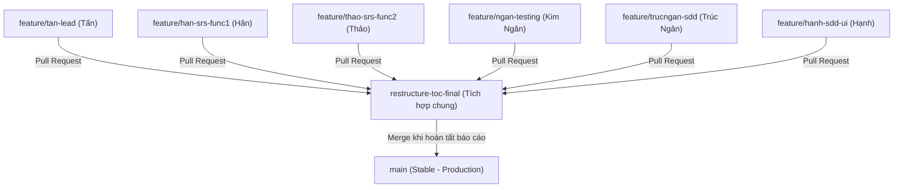

# 📋 KẾ HOẠCH VÀ QUY TRÌNH THỰC HIỆN DỰ ÁN (PROJECT PLAN)
## Manga Creation Workflow and Publishing Management System

> [!NOTE]
> Đây là tài liệu duy nhất và chính thức quản lý tiến độ, quy trình Git và phân công công việc của dự án. Tài liệu này liên kết các nội dung cũ của dự án cùng kế hoạch chuẩn hóa báo cáo theo cấu trúc mới.

---

## 🎯 1. Mục tiêu dự án
* **Đúng tiến độ:** Hoàn thành các giai đoạn tái cấu trúc, di chuyển nội dung và viết mới báo cáo đồ án trước hạn.
* **Chất lượng cao:** Nội dung báo cáo đầy đủ, chính xác, lập luận khoa học và thống nhất giữa các phần.
* **An toàn dữ liệu:** Đóng băng các nhánh chính, tuyệt đối không code đè lên nhau hoặc gây lỗi biên dịch LaTeX.
* **Đồng bộ thiết kế:** Đảm bảo tính nhất quán tuyệt đối giữa tài liệu đặc tả thiết kế, sơ đồ UML và hệ thống thực tế.

---

## 👥 2. Thành viên & Vai trò chính
* 👑 **Trương Trọng Tấn (Leader):** Tổng hợp, quản lý dự án, chuẩn bị mẫu nội dung báo cáo cho cả nhóm, biên soạn Lời cảm ơn, Thuật ngữ, Chương I, Chương VII và Phụ lục. Quản trị GitHub.
* 📝 **Giang Thị Ngọc Hân:** Đảm nhiệm đưa phần nội dung phân tích yêu cầu chức năng và đặc tả Use Case (Module 1) vào LaTeX.
* 🔍 **Dương Kim Ngân:** Đảm nhiệm đưa phần nội dung yêu cầu phi chức năng (NFR), Quy tắc nghiệp vụ (BR) và Kịch bản kiểm thử (Testing) vào LaTeX.
* 🎨 **Nguyễn Thanh Thảo:** Đảm nhiệm đưa phần nội dung Use Case và đặc tả Use Case (Module 2) vào LaTeX.
* 📐 **Nguyễn Thị Trúc Ngân:** Đảm nhiệm đưa phần nội dung kiến trúc tổng thể, sơ đồ UML hệ thống (Class Diagram do cả nhóm cùng vẽ) và kịch bản SPMP vào LaTeX.
* 💾 **Phan Thị Hạnh:** Đảm nhiệm đưa phần nội dung Cơ sở dữ liệu (Database - ERD do cả nhóm cùng vẽ), Giao diện (UI) và Hướng dẫn sử dụng vào LaTeX.

---

## 🗓️ 3. Lộ trình tái cấu trúc & Chuẩn hóa báo cáo (Chi tiết nhiệm vụ)

Hiện tại dự án đang tập trung vào quá trình chuyển dịch cấu trúc báo cáo từ cũ sang mới. Các đầu việc được chia làm 4 Phase cụ thể dưới đây:

### 📅 PHASE 1: Khóa cấu trúc & Dọn dẹp hệ thống (Hoàn thành)
*Mục tiêu: Thiết lập khung sườn thư mục LaTeX mới, dọn dẹp các lỗi cấu trúc hiện có.*
* [x] **[P1-01]** Tạo các file `.tex` mới với cấu trúc rỗng (chỉ có lệnh `\chapter`, `\section`, `\label`). (Tấn)
* [x] **[P1-02]** Cập nhật file `main.tex` để import đúng thứ tự các chương con thông qua lệnh `\input`. (Tấn)
* [x] **[P1-03]** Sửa lỗi trùng lặp nghiêm trọng trong file `chapters/03_3_uml_thiet_ke.tex` (xóa đoạn code bị lặp ở dòng 68-134). (Tấn)
* [x] **[P1-04]** Dọn dẹp tài nguyên thừa: Xóa file hình ảnh `Class_Diagram_pt.pdf` bị trùng lặp với `Class_Diagram.pdf`. (Tấn)
* [x] **[P1-05]** Chuẩn hóa lại định dạng bảng thuật ngữ trong `sections/thuat_ngu.tex`. (Tấn)
* [x] **[P1-06]** Build thử nghiệm PDF của khung sườn mới để đảm bảo không gặp lỗi biên dịch (compile error). (Tấn)

### 📦 PHASE 2: Di chuyển nội dung cũ sang cấu trúc mới
*Mục tiêu: Đưa toàn bộ nội dung từ các file cũ vào đúng vị trí mới trong cây thư mục.*

#### 🔄 Di chuyển nội dung SRS (Ngọc Hân & Thanh Thảo)
* [ ] **[P2-01]** Chuyển phần Giới thiệu chung & Quy trình nghiệp vụ từ `02_1_yeu_cau_chuc_nang.tex` sang `03_1_srs_tong_quan.tex`.
* [ ] **[P2-02]** Chuyển bảng mô tả Actor từ `03_2_uml_nghiep_vu.tex` và phần mô tả actor từ `01_gioi_thieu.tex` gộp chung vào `03_1_srs_tong_quan.tex` (§3.2.1).
* [ ] **[P2-03]** Di chuyển các sơ đồ Use Case (Admin, Mangaka, Assistant, Tantou Editor, Editorial Board) từ `03_2` sang `03_1_srs_tong_quan.tex` (§3.2.2).
* [ ] **[P2-04]** Di chuyển nội dung phần Yêu cầu phi chức năng (NFR) từ `02_2_yeu_cau_phi_chuc_nang.tex` sang `03_4_srs_nfr.tex`.

#### 🔄 Di chuyển nội dung SDD (Trúc Ngân & Phan Hạnh)
* [ ] **[P2-05]** Di chuyển thiết kế kiến trúc hệ thống và deployment từ `03_1_thiet_ke_tong_the.tex` sang `04_1_sdd_system.tex`.
* [ ] **[P2-06]** Di chuyển sơ đồ Swimlane và 3 sơ đồ Activity từ `03_2_uml_nghiep_vu.tex` sang `04_3_sdd_detailed.tex` (§4.3.1).
* [ ] **[P2-07]** Di chuyển 5 sơ đồ Sequence Diagram (đã dọn dẹp phần trùng lặp) từ `03_3_uml_thiet_ke.tex` sang `04_3_sdd_detailed.tex` (§4.3.2).
* [ ] **[P2-08]** Di chuyển Class Diagram tổng thể và mô tả các lớp từ `03_3` sang `04_3_sdd_detailed.tex` (§4.3.3).
* [ ] **[P2-09]** Di chuyển Sơ đồ ERD, Data Dictionary (10 bảng) và mô tả mối quan hệ từ `03_4_database_ui.tex` sang `04_2_sdd_database.tex`.
* [ ] **[P2-10]** Di chuyển danh sách UI hiện tại từ `03_4` sang `04_4_sdd_ui.tex`.

#### 🔄 Đồng bộ hóa tham chiếu (Cả nhóm thực hiện phần mình phụ trách)
* [ ] **[P2-11]** Sửa lại toàn bộ các nhãn `\label` bị trùng hoặc bị lỗi do phân tách file.
* [ ] **[P2-12]** Cập nhật lại đường dẫn hình ảnh trong lệnh `\includegraphics` tương ứng với vị trí file mới.
* [ ] **[P2-13]** Sửa lại các liên kết chéo `\ref` và `\pageref` trong tài liệu.

### ✍️ PHASE 3: Viết mới & Hoàn thiện nội dung thiếu
*Mục tiêu: Triển khai viết mới các chương, các sơ đồ UML và chi tiết kịch bản sử dụng còn thiếu.*

#### ✍️ Chương I: Giới thiệu dự án (Trọng Tấn)
* [x] **[P3-01]** Viết mục **1.3 Hệ thống hiện có** (§1.3.1 Quản lý thủ công, §1.3.2 Công cụ Trello/Notion và nhược điểm).
* [x] **[P3-02]** Viết mục **1.4 Cơ hội phát triển** (Lý do xây dựng, cơ hội tối ưu quy trình manga).
* [x] **[P3-03]** Xem xét loại bỏ phần Kết luận chương ở cuối Chương 1 theo đúng mẫu.

#### ✍️ Chương II: Kế hoạch quản lý dự án - SPMP (Trúc Ngân)
* [ ] **[P3-04]** Lập bảng phân tích **WBS (Work Breakdown Structure)** và ước lượng công sức (Man-days).
* [ ] **[P3-05]** Viết mục **2.1.2 Mục tiêu dự án** (chỉ tiêu thời gian, nỗ lực) và **2.1.3 Rủi ro dự án** (bảng Risk + kế hoạch ứng phó).
* [ ] **[P3-06]** Mô tả **Quy trình phát triển phần mềm** áp dụng và phương pháp quản lý chất lượng.
* [ ] **[P3-07]** Bổ sung **Sản phẩm bàn giao** theo từng giai đoạn / Sprint.
* [ ] **[P3-08]** Xây dựng ma trận phân công trách nhiệm **RACI**.
* [ ] **[P3-09]** Viết các phần Giao tiếp dự án & Quản lý cấu hình (tài liệu, mã nguồn, hạ tầng).

#### ✍️ Chương III: Đặc tả yêu cầu phần mềm - SRS
##### Phần tổng quan & UC Spec 1 (Ngọc Hân)
* [ ] **[P3-10]** Vẽ sơ đồ ngữ cảnh **Context Diagram** (§3.1.2) cho hệ thống Manga Workflow.
* [ ] **[P3-11]** Lập **Bảng tóm tắt Use Case** (§3.2.3) gồm cột ID, Use Case, Actor, Mô tả ngắn.
* [ ] **[P3-12]** Viết phần **System Functional Overview** (§3.3.1) gồm: Screens Flow, Screen Descriptions, Screen Authorization (ma trận Actor-Screen).
* [ ] **[P3-13]** Đặc tả chi tiết Use Case (UC Spec) cho các module:
  * [ ] UC-01 Đăng nhập & UC-02 Đăng xuất.
  * [ ] UC-03 đến UC-06 (Quản lý người dùng: Xem, Tạo, Cập nhật, Khóa).
  * [ ] UC-07 đến UC-10 (Quản lý Series: Tạo, Xem, Cập nhật, Theo dõi trạng thái).

##### Phần UC Spec 2 (Thanh Thảo)
* [ ] **[P3-14]** Đặc tả chi tiết Use Case (UC Spec) cho các module:
  * [ ] UC-11 đến UC-13 (Quản lý Chapter: Tạo, Cập nhật, Theo dõi).
  * [ ] UC-14 đến UC-15 (Quản lý Page: Tạo, Cập nhật trạng thái).
  * [ ] UC-16 đến UC-19 (Quản lý Task: Tạo/Phân công, Cập nhật, Theo dõi, Hủy).
  * [ ] UC-20 đến UC-22 (Quản lý Submission: Nộp, Xem chi tiết, Lịch sử).
  * [ ] UC-23 đến UC-25 (Quản lý Review: Tạo, Xem chi tiết, Phản hồi sửa).
  * [ ] UC-26 đến UC-28 (Xét duyệt & Xuất bản: Duyệt Series, Xuất bản Chapter, Ngừng phát hành).
  * [ ] UC-29 đến UC-31 (Quản lý Xếp hạng: Nhập vote, Xem BXH, Xem lịch sử).
  * [ ] UC-32 đến UC-33 (Quản lý Thông báo: Xem, Đánh dấu đã đọc).

##### Phần NFR & Quy tắc nghiệp vụ (Kim Ngân)
* [ ] **[P3-15]** Chuẩn hóa NFR: Thêm các chỉ số đo lường cụ thể cho Hiệu năng, Bảo mật, Khả năng mở rộng, Tính sẵn sàng, Khả năng sử dụng, Khả năng bảo trì.

#### ✍️ Chương IV: Thiết kế hệ thống - SDD
##### Kiến trúc & Thiết kế chi tiết (Trúc Ngân)
* [ ] **[P3-16]** Vẽ sơ đồ thành phần **Component / Package Diagram** (§4.1.3).
* [ ] **[P3-17]** Viết mô tả chi tiết công nghệ sử dụng (**Technology Stack**).
* [ ] **[P3-18]** Bổ sung danh sách các **phương thức (Methods)** cho từng thực thể trong Class Diagram.

##### Thiết kế giao diện (Phan Hạnh)
* [ ] **[P3-19]** Thiết kế **UI Mockup/Wireframe** cho 9 giao diện chính:
  * [ ] Dashboard (chung và riêng theo vai trò)
  * [ ] Trang đăng nhập
  * [ ] Quản lý Series (Danh sách & Chi tiết)
  * [ ] Quản lý Chapter
  * [ ] Quản lý Task
  * [ ] Giao diện Nộp Submission
  * [ ] Giao diện Review & Đánh giá
  * [ ] Trung tâm thông báo
  * [ ] Bảng xếp hạng Series

#### ✍️ Chương V: Tài liệu kiểm thử - Testing (Kim Ngân)
* [ ] **[P3-20]** Xác định **Phạm vi kiểm thử** (§5.1).
* [ ] **[P3-21]** Xây dựng **Chiến lược kiểm thử** (§5.2) và **Kế hoạch kiểm thử** (§5.3).
* [ ] **[P3-22]** Triển khai viết chi tiết **15 kịch bản kiểm thử (Test Cases)** từ TC-01 đến TC-15.
* [ ] **[P3-23]** Thiết lập biểu mẫu **Báo cáo kiểm thử** (§5.5) thống kê kết quả Pass/Fail.

#### ✍️ Chương VI: Gói phát hành & Hướng dẫn sử dụng (Phan Hạnh)
* [ ] **[P3-24]** Lập danh mục gói sản phẩm bàn giao (Deliverable Package).
* [ ] **[P3-25]** Viết hướng dẫn cài đặt chi tiết (Yêu cầu hệ thống, cấu hình môi trường, setup database).
* [ ] **[P3-26]** Viết hướng dẫn sử dụng (User Manual) chi tiết cho cả 5 Actor.

#### ✍️ Chương VII & Phụ lục (Trọng Tấn)
* [ ] **[P3-27]** Viết phần **Kết luận & Hướng phát triển** ở chương cuối.
* [ ] **[P3-28]** Bổ sung tài liệu API trong Phụ lục A (ít nhất 5-10 endpoint thực tế).

### 🔍 PHASE 4: Review & Đồng bộ định dạng
*Mục tiêu: Đảm bảo toàn bộ tài liệu nhất quán về mặt trình bày và không có lỗi biên dịch.*
* [ ] **[P4-01]** Đồng bộ font chữ, khoảng cách dòng, lề trang theo cấu hình `config/`. (Tấn)
* [ ] **[P4-02]** Đồng bộ định dạng bảng biểu, tiêu đề hình vẽ và chú thích (caption). (Tấn)
* [ ] **[P4-03]** Kiểm tra lỗi chính tả tiếng Việt và thuật ngữ chuyên ngành toàn bộ báo cáo. (Tấn)
* [ ] **[P4-04]** Biên dịch thử nghiệm lần cuối, kiểm tra log cảnh báo (warning) và sửa triệt để. (Tấn)
* [ ] **[P4-05]** Xuất bản bản in PDF chính thức để nộp giảng viên. (Tấn)

---

## 💻 4. Quy trình Git Workflow an toàn cho nhóm

Mục tiêu: Đóng băng nhánh `main` và nhánh tích hợp chung `restructure-toc-final`. Toàn bộ thành viên (kể cả Leader) đều làm việc trên nhánh riêng.

### 🌐 Sơ đồ luồng Git (Git Branching Model)



### 🛠️ Quy trình làm việc dành cho thành viên
1. **Cập nhật nhánh tích hợp chung ở máy cá nhân:**
   ```bash
   git checkout restructure-toc-final
   git pull origin restructure-toc-final
   ```
2. **Tạo nhánh con riêng để làm việc:**
   Đặt tên nhánh theo quy ước `feature/ten-chuc-nang` (VD: `feature/tan-lead`).
   ```bash
   git checkout -b feature/your-name-task
   ```
3. **Thực hiện viết báo cáo và commit nhỏ:**
   ```bash
   git add .
   git commit -m "Mô tả chi tiết nội dung đã viết bằng tiếng Việt"
   ```
4. **Đẩy nhánh con lên GitHub:**
   ```bash
   git push origin feature/your-name-task
   ```
5. **Tạo Pull Request (PR) trên GitHub:**
   * Chọn nhánh đích cần merge vào là **`restructure-toc-final`** (Không được chọn `main`).
   * Gắn nhãn hoặc ghi nội dung nhiệm vụ tương ứng từ Phase 2 hoặc Phase 3.

### 👑 Quy trình duyệt bài & Tích hợp dành cho Leader (Trương Trọng Tấn)
1. **Xem xét Pull Request trên GitHub:** Kiểm tra file thay đổi, tránh việc ghi đè nhầm file.
2. **Kiểm tra biên dịch cục bộ trước khi Merge:**
   ```bash
   git fetch origin
   git checkout feature/ten-nhanh-cua-thanh-vien
   git pull origin feature/ten-nhanh-cua-thanh-vien
   pdflatex -interaction=nonstopmode main.tex
   ```
   *Chỉ merge khi PDF biên dịch thành công không bị Fatal Error.*
3. **Chấp nhận Merge** trên GitHub để gộp code vào `restructure-toc-final`.

### ⚡ Cách xử lý xung đột (Git Conflict)
1. Chuyển về nhánh chung và cập nhật code mới nhất:
   ```bash
   git checkout restructure-toc-final
   git pull origin restructure-toc-final
   ```
2. Chuyển sang nhánh con đang bị conflict:
   ```bash
   git checkout feature/ten-nhanh-bi-conflict
   ```
3. Gộp nhánh `restructure-toc-final` vào nhánh con:
   ```bash
   git merge restructure-toc-final
   ```
4. Mở file conflict trên VS Code, chọn giữ lại đoạn code đúng nhất và xóa bỏ các ký tự đánh dấu xung đột (`<<<<<<<`, `=======`, `>>>>>>>`).
5. Commit và push lại nhánh con:
   ```bash
   git add .
   git commit -m "Fix: giải quyết xung đột với nhánh restructure-toc-final"
   git push origin feature/ten-nhanh-bi-conflict
   ```

---

## 📊 5. Quy trình quản lý công việc và quy tắc ứng xử

### 🔄 Quy trình quản lý tiến độ (Jira Workflow)


* **To Do:** Nhiệm vụ chưa bắt đầu.
* **In Progress:** Thành viên đang tích cực xử lý.
* **Review:** Đang chờ kiểm tra chất lượng và duyệt (Leader hoặc chéo thành viên).
* **Done:** Đã kiểm duyệt đạt yêu cầu và được merge vào nhánh chính.

### ⚠️ Quy tắc ứng xử và thực hiện đồ án (Team Rules)
1. **Tính nhất quán:** Tất cả tài liệu LaTeX phải sử dụng chung một font chữ, cỡ chữ, căn lề và định dạng cấu hình tại `config/`.
2. **Đồng bộ thiết kế:** Sơ đồ UML, ERD và Từ điển dữ liệu phải ăn khớp tuyệt đối với mô tả văn bản và mã nguồn hệ thống thực tế.
3. **Cập nhật tiến độ:** Cập nhật trạng thái công việc trên Jira tối thiểu **1 lần/ngày** vào cuối ngày làm việc.
4. **Kiểm duyệt chéo:** Mọi PR trước khi merge đều phải được review và Leader phê duyệt.
5. **Sao lưu dữ liệu:** Luôn push code lên GitHub vào cuối mỗi buổi làm việc, tránh lưu trữ cục bộ duy nhất trên máy cá nhân.
